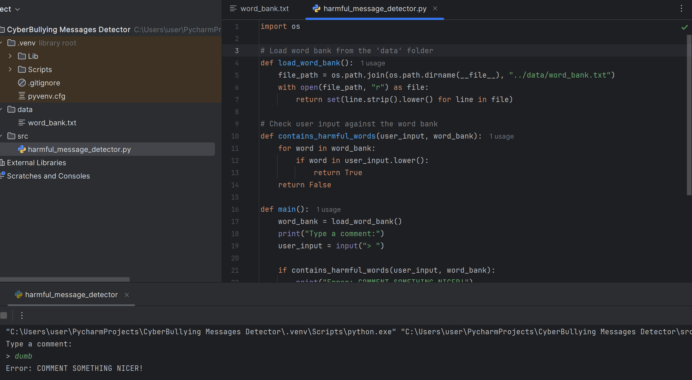

# Wale's Portfolio

# Project 1: Cyber Bullying Detection System
This is a capstone project I completed in the final year of my Bachelor's degree in Information Technology. I developed a Python-based system that identifies and prevents harmful online messages, such as hate speech and threats, to promote safer and more respectful interactions on social media platforms.

## Highlights:

* Technology: Python, Natural Language Processing (NLP), and Machine Learning (LSTM models).
* Focus: Detect and block messages containing hate speech, threats, or mocking.
* Interactivity: Provides real-time feedback to users on flagged messages.
## Core Functionality Code: Harmful Message Detection System 
