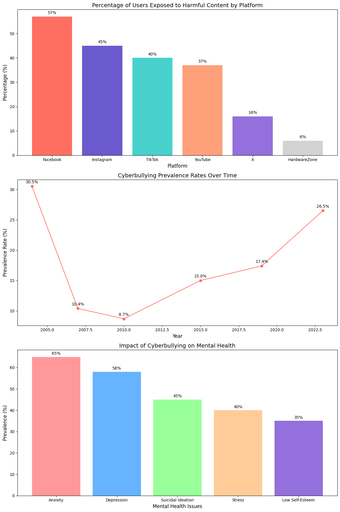

# Wale's Portfolio

# Project 1: Cyber Bullying Detection System
This is a capstone project I completed in the final year of my Bachelor's degree in Information Technology. I developed a Python-based system that identifies and prevents harmful online messages, such as hate speech and threats, to promote safer and more respectful interactions on social media platforms.

## Highlights:

* Technology: Python, Natural Language Processing (NLP), and Machine Learning (LSTM models).
* Focus: Detect and block messages containing hate speech, threats, or mocking.
* Interactivity: Provides real-time feedback to users on flagged messages.
  
## Technical Architecture of the Detection System 
This diagram illustrates the six-phase workflow of the detection system, highlighting data collection, pre-processing, classification, testing, evaluation, and comprehensive analysis to create a safer online environment.

## Core Functionality Code: Harmful Message Detection System 
This script implements the primary functionality of the Cyberbullying Detection System by:

* Loading a Custom Word Bank: Reads a pre-defined set of harmful or offensive words stored in a word_bank.txt file.
* User Input Validation: Accepts user comments and checks them against the word bank to identify potentially harmful content.
* Real-Time Feedback: Provides immediate feedback by alerting users to rephrase their comments if harmful words are detected.
  
## Visualization of Cyberbullying Trends and Impacts 
These graphs illustrate the prevalence and impact of cyberbullying, using data from reliable sources.

Graph 1: Percentage of Users Exposed to Harmful Content
* Source: Ministry of Digital Development and Information (MDDI) Online Safety Poll (2024).
* Insight: Facebook leads with 57% of users encountering harmful content, followed by Instagram (45%) and TikTok (40%).

Graph 2: Cyberbullying Prevalence Rates Over Time
* Source: Studies by Patchin & Hinduja, CDC, and others.
* Insight: Cyberbullying rates have risen over time, with spikes in 2015 and 2023.

Graph 3: Impact on Mental Health
* Source: Frontiers in Psychology (2024).
* Insight: Anxiety (65%) and depression (58%) are the most common impacts, highlighting the psychological toll of cyberbullying.

Overall Process
* Data Collection: Gathered data from government surveys, academic studies, and longitudinal reports.
* Data Cleaning: Extracted relevant statistics and ensured consistency across sources.
* Visualization: Created clear and informative charts using Python libraries (Matplotlib and Seaborn) to depict trends and impacts effectively.

## Project Outcomes
The Cyberbullying Detection System successfully demonstrated its ability to identify and prevent harmful online interactions. Key outcomes include:

* Efficient Detection: High accuracy in identifying harmful words or phrases in user-generated content.
* Real-Time Feedback: Immediate notifications for users to rephrase harmful comments, fostering positive interactions.
* Promoting Safer Online Spaces: Showcased the potential to mitigate cyberbullying on social media platforms.

## Future Scope
To enhance and scale the system, the following improvements are suggested:

* Machine Learning Integration: Implement algorithms for better context-based detection.
* Multilingual Support: Expand detection to multiple languages for global applicability.
* Platform Scalability: Optimize the system for handling large data volumes on social media platforms.
* Social Media Integration: Enable seamless integration with social media APIs for broader adoption.
