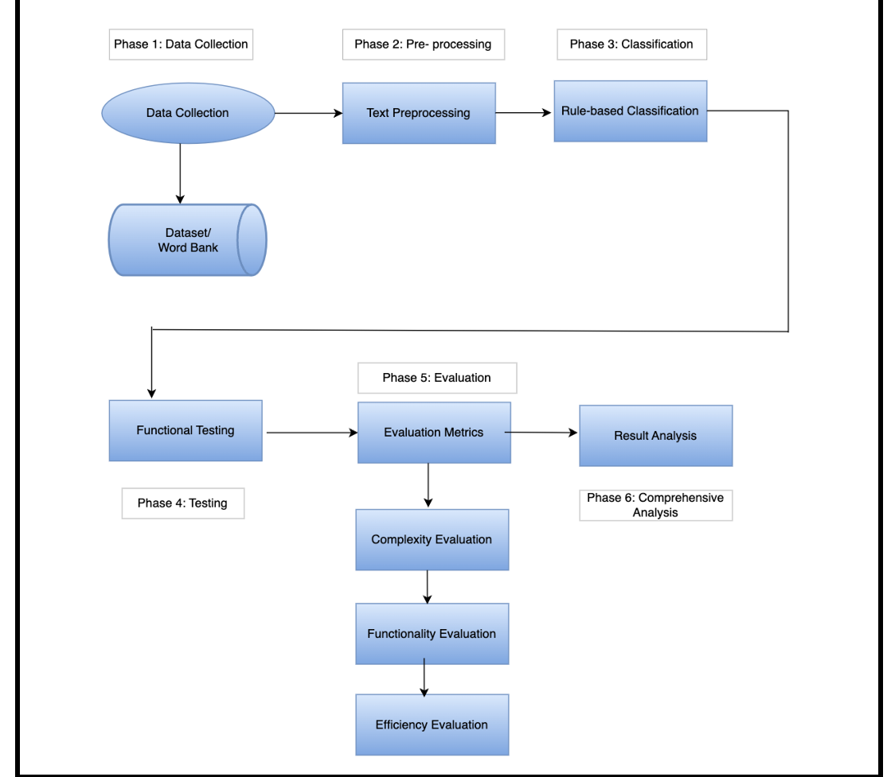

# Wale's Portfolio

# Project 1: Cyber Bullying Detection System
This is a capstone project I completed in the final year of my Bachelor's degree in Information Technology. I developed a Python-based system that identifies and prevents harmful online messages, such as hate speech and threats, to promote safer and more respectful interactions on social media platforms.

## Highlights:

* Technology: Python, Natural Language Processing (NLP), and Machine Learning (LSTM models).
* Focus: Detect and block messages containing hate speech, threats, or mocking.
* Interactivity: Provides real-time feedback to users on flagged messages.
  
## Technical Architecture of the Detection System 
This diagram illustrates the six-phase workflow of the detection system, highlighting data collection, pre-processing, classification, testing, evaluation, and comprehensive analysis to create a safer online environment.

## Core Functionality Code: Harmful Message Detection System 
This script implements the primary functionality of the Cyberbullying Detection System by:

* Loading a Custom Word Bank: Reads a pre-defined set of harmful or offensive words stored in a word_bank.txt file.
* User Input Validation: Accepts user comments and checks them against the word bank to identify potentially harmful content.
* Real-Time Feedback: Provides immediate feedback by alerting users to rephrase their comments if harmful words are detected.
  
## Visualization of Cyberbullying Trends and Impacts 
This section highlights the analysis of cyberbullying data through insightful visualizations to better understand its prevalence and consequences. The key features include:

* Percentage of Users Exposed to Harmful Content: A bar chart comparing exposure rates across different social media platforms.
* Frequency of Cyberbullying Incidents: A pie chart showing how often users experience cyberbullying, categorized as daily, weekly, or monthly.
* Impact on Mental Health: A horizontal bar graph illustrating the psychological effects of cyberbullying, such as anxiety, depression, and other impacts.

## Project Outcomes
The Cyberbullying Detection System successfully demonstrated its ability to identify and prevent harmful online interactions. Key outcomes include:

* Efficient Detection: High accuracy in identifying harmful words or phrases in user-generated content.
* Real-Time Feedback: Immediate notifications for users to rephrase harmful comments, fostering positive interactions.
* Promoting Safer Online Spaces: Showcased the potential to mitigate cyberbullying on social media platforms.

## Future Scope
To enhance and scale the system, the following improvements are suggested:

* Machine Learning Integration: Implement algorithms for better context-based detection.
* Multilingual Support: Expand detection to multiple languages for global applicability.
* Platform Scalability: Optimize the system for handling large data volumes on social media platforms.
* Social Media Integration: Enable seamless integration with social media APIs for broader adoption.
